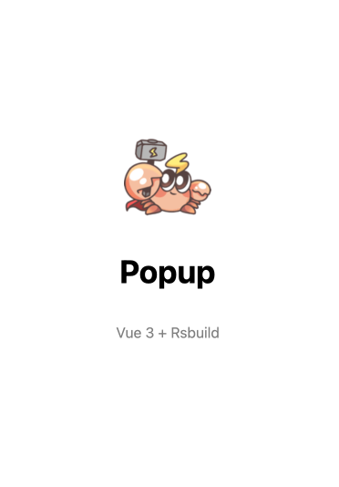

# Vue 3 + Rsbuild Chrome Extension 插件开发模板

支持 Vue3 开发 Chrome 插件扩展，由 Rsbuild 强力驱动。

<p align="center">
  
</p>

## 特性
- 支持开发热更新
- 关闭开发服务器 URL 输出，避免在插件开发时打印无关信息
- 默认使用 Vue SFC，支持样式隔离与快速迭代

## 目录结构

```
src/
  popup/
    main.js          # 弹窗入口
    Popup.vue        # 弹窗页面
  options/
    main.js          # 选项页入口
    Options.vue      # 选项页页面
  background/
    index.js         # 后台脚本入口（Service Worker）
  content/
    index.js         # 内容脚本入口
public/
  manifest.json      # 扩展清单（已与构建产物路径对齐）
  favicon.png        # 用作图标与页面 logo
rsbuild.config.js    # Rsbuild 配置
```

## 安装与开发

```bash
pnpm install
pnpm run dev
```

## 构建与预览

```bash
pnpm run build
pnpm run preview
```

## 加载扩展（Chrome）

1. 执行 `pnpm run build`
2. 打开 `chrome://extensions`
3. 开启“开发者模式”
4. 点击“加载已解压的扩展程序”，选择项目内的 `dist` 目录

加载成功后：
- 点击扩展图标打开 `popup`
- 在扩展详情中打开 `options`
- 访问任意 `http/https` 页面时，`content` 脚本会运行

## 自定义指南

- 弹窗尺寸：在 `src/popup/Popup.vue` 的 `.content` 中设置 `width/height`
- 选项页样式：`src/options/Options.vue` 已与弹窗统一；如需不同布局，可自行修改
- 图标：将图片放入 `public/`，在页面中使用相对路径（例如 `favicon.png`）即可
- 清单与路径：`public/manifest.json` 中的路径需与构建产物一致
  - `background.service_worker: js/background.js`
  - `content_scripts[].js: js/content.js`
  - `action.default_popup: popup.html`
  - `options_page: options.html`

## 常见问题

- 无法加载清单 / 脚本：确认 `manifest.json` 的脚本路径是否为 `js/...`，并且图标文件存在（本项目为 `favicon.png`）
- 开发服务器日志：已通过 `server.printUrls: false` 关闭，如需自定义输出可使用函数形式
- 生产移除 `console`：可在配置中启用 `performance.removeConsole`

## 参考
- 使用 Rsbuild 构建 Chrome 扩展程序：https://blog.wildseeder.com/build-chrome-extensions-with-rsbuild/
- Chrome 扩展开发文档：https://developer.chrome.com/docs/extensions
- Rsbuild 文档：https://rsbuild.rs
- Vue 插件文档：https://rsbuild.rs/zh/guide/framework/vue
